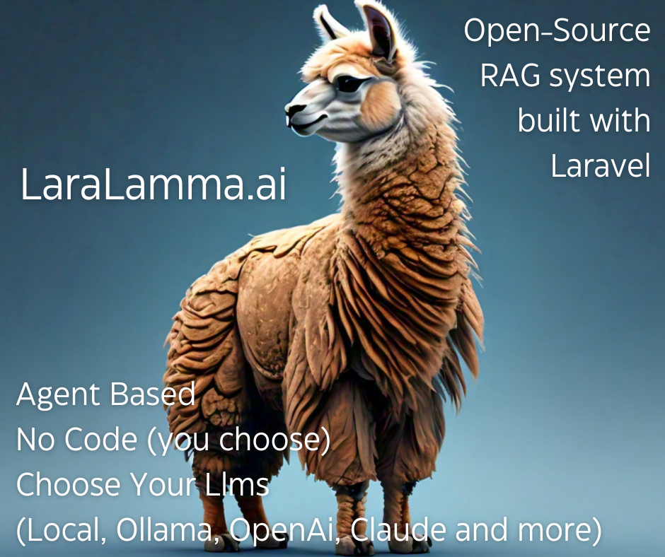

LaraLamma the Laravel RAG System
===================================

**LaraLamma**
LaraLamma is based on Laravel and is a great foundation for any LLM centric application
especially a RAG system.

A RAG system (Retrieval augmented generation system (RAG - an architectural approach that can improve the efficacy of large language model (LLM) applications

.. note::

   This project is under active development.

Contents
--------

.. toctree::

   overview
   setuplocal
   firstcollection
